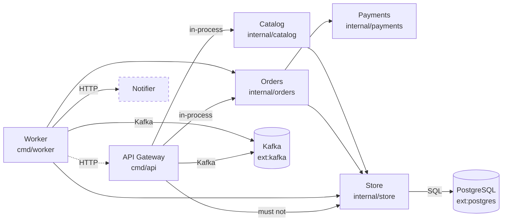

# Shop architecture (dependency diagram)

The same rules as `design.md`, written as a dependency diagram that archdrift
reads by code (`archdrift check --no-llm`). Every arrow means "depends on".

```mermaid
flowchart LR
  %% archdrift: dependencies
  api["API Gateway<br/>cmd/api"]
  worker["Worker<br/>cmd/worker"]
  orders["Orders<br/>internal/orders"]
  catalog["Catalog<br/>internal/catalog"]
  payments["Payments<br/>internal/payments"]
  store["Store<br/>internal/store"]
  pg[("PostgreSQL<br/>ext:postgres")]
  kafka[("Kafka<br/>ext:kafka")]
  notifier[Notifier]

  api -->|in-process| orders & catalog
  api -- must not --> store
  api -->|Kafka| kafka
  worker -->|Kafka| kafka
  worker --> orders --> payments
  worker --> store
  orders --> store
  catalog --> store
  store -->|SQL| pg
  worker -. HTTP .-> api
  worker -- HTTP --> notifier
  classDef planned stroke-dasharray: 5 5
  class notifier planned
```
